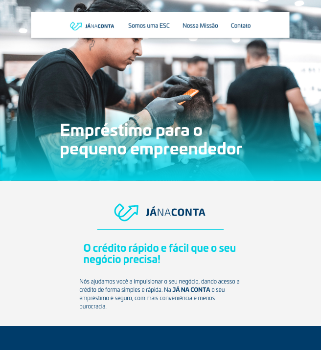
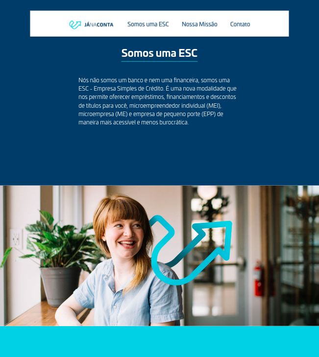
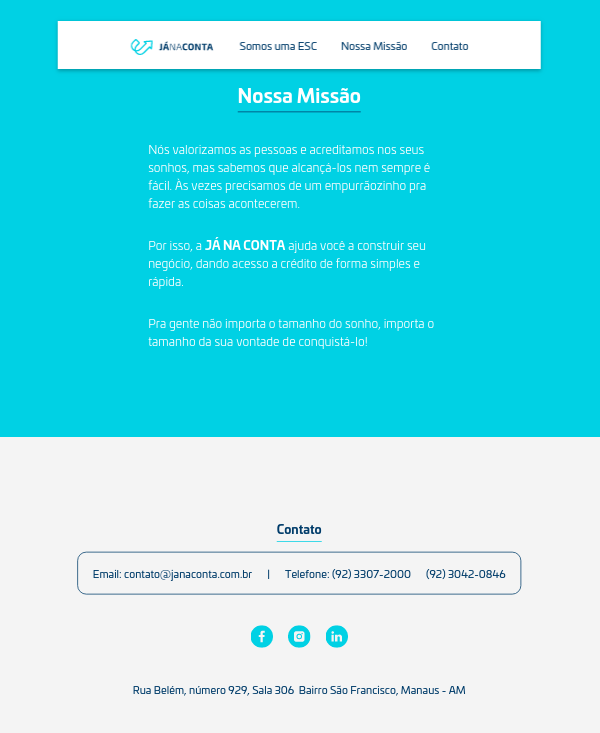

# Website JaNaConta

**Design by [Vinculo Design Estratégico](http://vinculodesign.com/)**

* The website was built using HTML, CSS and Javascript.
* For the project management: GitHub Projects, Kanban-style table, and also trello for communication with the design team.

## Biggest takeaways

* Learned about last steps on deploying a simple website using FileZilla;
* SEO and Page Loading Speed and how they affect the final PageSpeedInsights index on Google;
* WhatsApp-related meta tags (and many other meta tags);
* Working with different brakpoints and the addvantages of using a framework and Grid system;
* Working with CSS Variables. 
